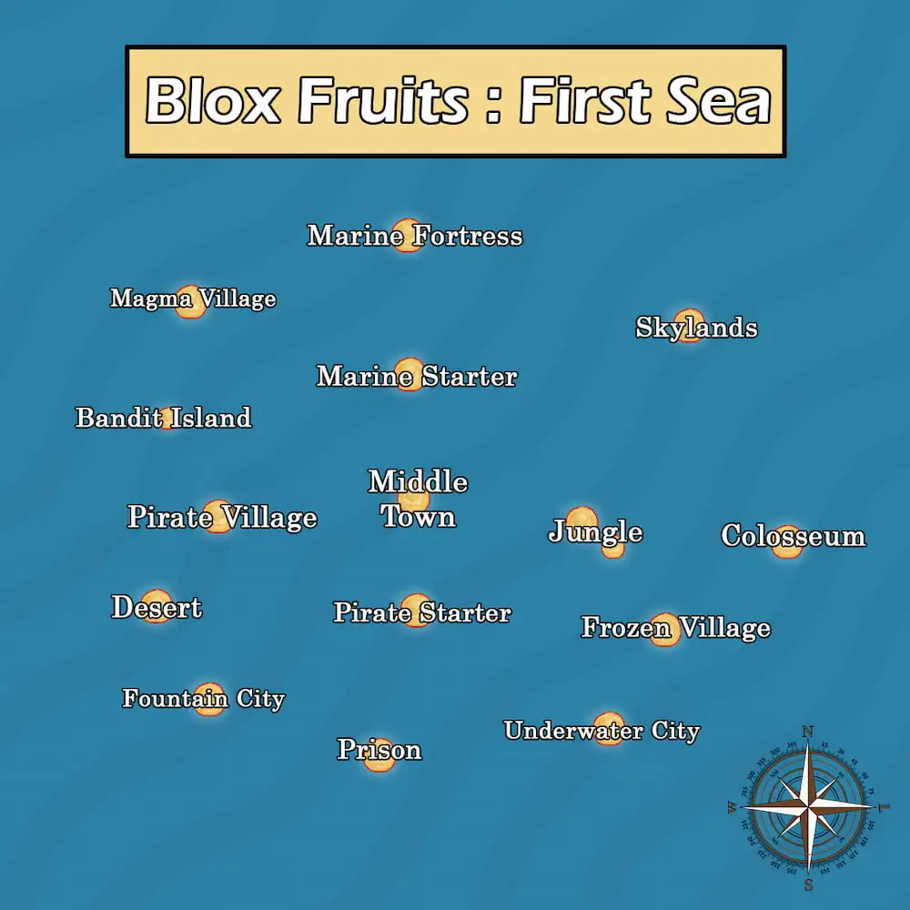

# First Sea

First sea is the welcoming area for the new adventurer of the Blox fruit world. This area is designed for adventurers level 1 to 700. In this sea, you will learn how to fight enemies, perform quests and gain levels providing your character enough strength to fight high level enemies. This area includes 13 islands to explore, each of which has its unique structure and challanges that adjust to your level.

<!-- First Sea Map -->

The first sea is the most peaceful and smallest map in Blox Fruit. Here, you will be able to learn how to handle different  kind of enemies.

## Starter Island

(Pirate Starter/Marine Starter)

Upon entering the game, this island will be your starting point on your journey. Here you will encounter NPC such as Set home point to set your spawn point to that area, the Blox Fruit dealer where you can buy fruit to use in battles, a sword dealer who sells Katana and Cutlass that may help you in fighting enemies, there is also a boat dealer where you can buy boat to travel across the map. you will also encounter the **Bandit quest giver** if you are a pirate and **Marine leader** if you are a marine

## Jungle

Once you become level 15 you will be able to take quest here for better expierence. You will be able to get here by swimming or buying a both on **Starter Island**.

