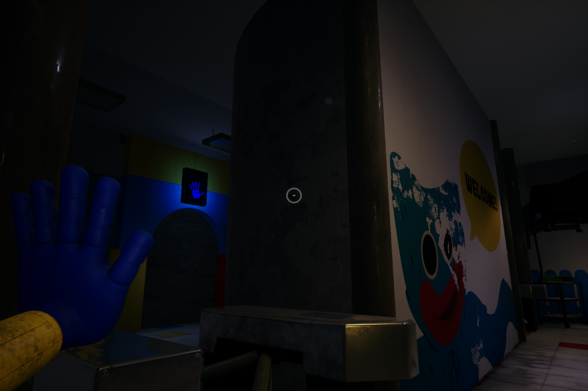

# Chapter 1 - *A TIGHT SQUEEZE*

After watching Playtime Co.’s advertisement for the Poppy Playtime doll in the game’s opening moments, you find yourself standing in the factory’s dimly lit reception area. This marks the beginning of your journey—to uncover whether the Playtime Co. staff are truly still inside, or if the letter was nothing more than a lie.

The first thing you’ll need to do is head toward the table at the center of the facility and pick up the ***green VHS tape*** located in the right corner. The tape is labeled **"LIETH PIERRE CLOSING"**.

After picking up the green VHS tape, look to your right—you’ll see a green VHS player just below a television. Use it to play the tape you found earlier and listen closely. Although it doesn't offer any direct clues, it does give you a warning and a hint about the true nature of the facility.

## **The Audio**
Hi. my name is Leith Pierre, and I'm the Head of Innovation here at the Playtime Co. Toy Factory.
If you're seeing this, then you're trespassing.

Yeah, we play this little tape on loop whenever we close the factory for the day.

So trespasser, just to make you aware.

While we pride ourselves primarily on our high quality toys and excellent childcare, we also pride ourselves on our security.

For example, this facility is full of hidden motion triggers which, once set off, will turn on the factory's emergency alarms and directly contact the authorities!

And that's one of the more tame aspects of our security system.

No spoilers...

So, you've got my warning. It's not too late to turn around. I just hope that you're certain whatever you're doing is worth it.

## **How to solve the Security-code**

In the factory’s reception area, you will see two rooms: the **Security** on the left and the **Gift Shop** on the right. Inside the Security Room, you’ll find an **important equipment** that you will need throughout the game.

To enter the **Security area**, you'll need to unlock the door by **entering the correct color combination**.

To find the **color combination for the locked door**, you first need to go to the **Gift Shop**.

When you enter the Gift Shop, you’ll notice a **small train circling on a track above you**. Observe the **color of the train** and **its carriages**, it is the color sequence of the security door.

### **Color Combination**
- Green
- Pink
- Yellow
- Red

Now that you know the combination go back to the Security area and unlock the door.

## **Grab Pack**

Now that you are inside the Security room, head-staight to the computer table on the left corner. You will see a **blue VHS tape** labeled **GRAB PACK TRAINING**, pick it up and put it to the **blue VHS player** below the televition on your right side.

"Once you insert the blue VHS tape into the blue VHS player, it will play an informative video explaining how to use the **Grab Pack**—the essential tool you’ll be using throughout the game.

Once the video ends, the glass door to the left of the television will open, allowing you to retrieve the **GrabPack**. Pick it up to equip your blue left hand. Before continuing, take a moment to practice using the **GrabPack** by **grabbing and pulling objects—this is its main function**.

Find an object around the room you want to grab, then **press the left mouse button to launch the hand toward your target**. Once the hand grasps the object, hold the **left mouse button to pull it towards you**.

Now that you've mastered using the GrabPack, it's time to continue your mission. Head back to the reception area and approach the **turnstiles** on either side of the front desk.

There, you'll see a closed door with a **blue hand mark on a pressure plate above it**. Use your GrabPack to shoot your blue left hand at the pressure plate and **hold it there until the blue bar above the mark is full**. Once it's full, the door will open, leading you into the Playtime Co. lobby.

## **Playtime Co. Lobby**

Upon entering the lobby, you’ll immediately see a big, lovable, and floppy mascot. His name is **Huggy Wuggy**. If you want to learn more about him, you can interact with the kiosk in front of the mascot.

To continue your mission, look around the lobby—you’ll notice two closed doors, each with pressure plates above them. The door on the right has two pressure plates: one with a blue left-hand mark and another with a red right-hand mark. Meanwhile, the door on the left has a single pressure plate above it with a blue hand mark, just like the door in the reception area.

Focus first on the left door. When you use your left hand on the pressure plate, it will cause a **short circuit** in the wires connected to the Power Room.

## How to turn on the power

As the power cuts out, you'll hear a **distinct clink—like a key falling somewhere in the lobby**. Head back to the Huggy Wuggy mascot and look at his **right hand**. You'll now see a **golden key** in front of his palm. Grab it using your Grabpack.

When you get the golden key, look to the left side of the lobby and find the door labeled **POWER**. with the use of the golden key, you will be able to open the door, leading you to a room with a **power generator**.

Now that you're inside the Power Room, walk straight ahead until you reach the **second building’s pillar**, then turn right and continue walking.

 As you look to your right, you’ll see a **red handlebar** next to a hand mark. Use your GrabPack to grab the handle and **pull the door open**.

You now have access to a power source—but how do you use it? The GrabPack has **conductive features** that allow you to transfer power from the source. Simply attach your left hand to the power source, then walk toward the designated object and make contact with it using the GrabPack’s wire to transfer the electricity.

Grab the power source and head straight to the nearest node. **Nodes are tall poles with a ring circling a sphere at the top**. Touch the node with the GrabPack's wire—this will cause the sphere on top to glow.

when the first node is activated, go to the next node near the entrance and make the GrabPack's wire touch it. when both of them are activated, the power will come back and lights in the facility will turn on.

Now that you’ve restored the power, exit the room and return to the lobby. There, you’ll notice something unsettling—the Huggy Wuggy mascot is no longer where it once stood. Hmm... where did it go?

Let’s not think about that for now. Head back to the locked door you tried to open earlier—you can now access it thanks to the restored power.

Enter the room. Before you reach the end of the path, you’ll notice an arm on the left door—looks familiar, doesn’t it? Instead of avoiding it head straight to that door and you will find your way in the storage area.

## Getting the Grab Pack's Right hand

In the storage room, you’ll notice an orange VHS player and a television in front of the stairs. You won’t need them just yet. Instead, head up the stairs and enter the room above.

Upon entering the room, you’ll see a yellow crane above the area. You need to activate it to obtain the red right hand for your GrabPack.

## Activating the terminal

To activate the crane, you need to **power the terminal** on the catwalk you used to enter the room. To do this, find **four cubes with glowing stripes** and place them into the terminal.

Pick up the **blue cube** near the broken handrail and insert it into the terminal, then **jump down**.

Now that you're on the floor, search the area for three more cubes. **Their locations may vary each time you play**, but they are commonly found on the **shelves**.

After finding the cubes, go between the first two shelves. You’ll find an **orange VHS tape** on a tilted shelf.

Head back to where you landed after jumping into the area. If you look to your left, you'll see an **orange handlebar** with a colored hand mark around it. Use your GrabPack to grab the handle and pull open the sliding door to access the storage room. Now, you’ll be able to slot the orange VHS tape you just found into the orange VHS player.

The tape doesn’t offer any clues about finishing the game—it simply features two people talking and complaining about the boxes.

By putting all the ramaining cube to the terminal, the crane will move to the **glass box contaning the red right hand** of your grabpack and drop in on the conveyor belt. Jump down and get the hand. 

The red right hand can also grab and pull objects, just like your blue left hand. To use your right hand, **press the right mouse button**. With both hands equipped, you can now fully utilize your GrabPack, making it **more powerful**. You’ll also be able to **access doors and facilities** that require both hands to operate.

At the end of the conveyor belt, you’ll see a steel door with pressure plates on both sides. Use both hands of your GrabPack to activate the pressure plates and open the steel door.

The steel door won’t fully open, so you’ll need to crouch to enter. To crouch, press the Ctrl key on your keyboard. Follow the conveyor belt—you’ll slide down, and at the end, you’ll find that the **door ahead is closed**.

## Open the Conveyor Belt's Door

Once you slide down, you can’t go back—you’ll need to **power the door** to open it.

**Head to the first right corner** in the vent and follow the path until you reach the end.

When you reach the end of the vent, turn left. Directly ahead, you’ll notice a **path running through the middle**—follow it, and you’ll find yourself in the center of the walkway.

In front of you is an **outlet that needs to be powered**. To your right, you’ll spot a **power source**, and to your left, a **node**—just like the ones you encountered in the Power Room back in the lobby. Use either hand of your GrabPack to **grab the power source**.

Stretch the wire across to **make contact with the node**. **This will transfer power and activate the mechanism ahead**.

After connecting the wire to the node, **walk to your left, then turn right**. You’ll see the **outlet you spotted earlier** in the middle of the walkway. Use your other hand to grab the outlet—this will complete the circuit and **power the door open**.

Now that you’ve successfully powered the outlet, the **door will open**, and the conveyor belt will force you forward into the **Make-A-Friend factory**.

## Powering The Make A Friend Factory

At the center of the factory, you’ll find a **console** with a red button marked **Needs Power**. Your objective in this area is to **build a toy** using the Make-A-Friend machine. However, the **factory is currently without power, and you’ll need to restore it before the machine can be activated**.

Look around the factory and you will spot a **stairs at the back of the room**, climb it up to reach the catwalk above the factory.

upon reaching the top, you will see a **pink VHS player** in the corner and TV above it, you'll need it later on.

On the catwalk, you’ll find a **gap in the floor**. To cross it, pull the orange handlebar to **slide out the retractable path** and cover the hole.

If you **walk across the retractable path and look to your right**, you’ll see a **pink VHS tape**. Pick it up and insert it into the pink VHS player you saw earlier.

The pink VHS tape is about the interview of Stella, the head of Playcare.

Back on crossing the catwalk, you’ll see a power source. Grab it using either hand of your GrabPack.

As you continue walking, you’ll come across **another retractable path on your right—grab** and pull it to create a short path that leads to the power nodes.

After crossing the retractable path, follow **the walkway to your right** and move to the left side of the outlet. Then, use your other GrabPack hand to **pull back the same retractable path** you activated earlier.

Go back to where the power nodes are, but **don’t use the retractable path**. The wire will be blocked by the catwalk supports, which will prevent you from reaching the power outlet later.

Make the wire touch each power node, then use the retractable path to reach the power outlet at a shorter distance. Use your other hand to grab the power outlet, and **this will activate the Make-A-Friend factory machine**.

With the power back on, it’s finally time to **build a toy—your very own friend**.

Jump down to the area where the Make-A-Friend machine is located—don’t worry, **you won’t take any damage**. Head over to the central console, which should now display **Power On**, and **press the red button** to begin the toy creation process.

Once the machine is activated, look to your left and focus on the **three capsules**. **Pull the lever** on each one to release the toy parts.

After pulling all the lever, head to the other side of the machine and **wait as it assembles your new toy friend**.

Once the toy reaches the end of the conveyor belt, pick it up. Head to the back of the area—just to the left of the stairs you climbed earlier—and you’ll find a door with a sign that reads **Nobody Leaves Without a Toy.** On the right side of the door, there’s a toy scanner. Place your toy on it and wait for the door to open.

## Huggy Wuggy Chase

Now that you have your toy, prepare yourself—someone, or perhaps something, in the factory wants to take it from you. Don’t let it catch you.

