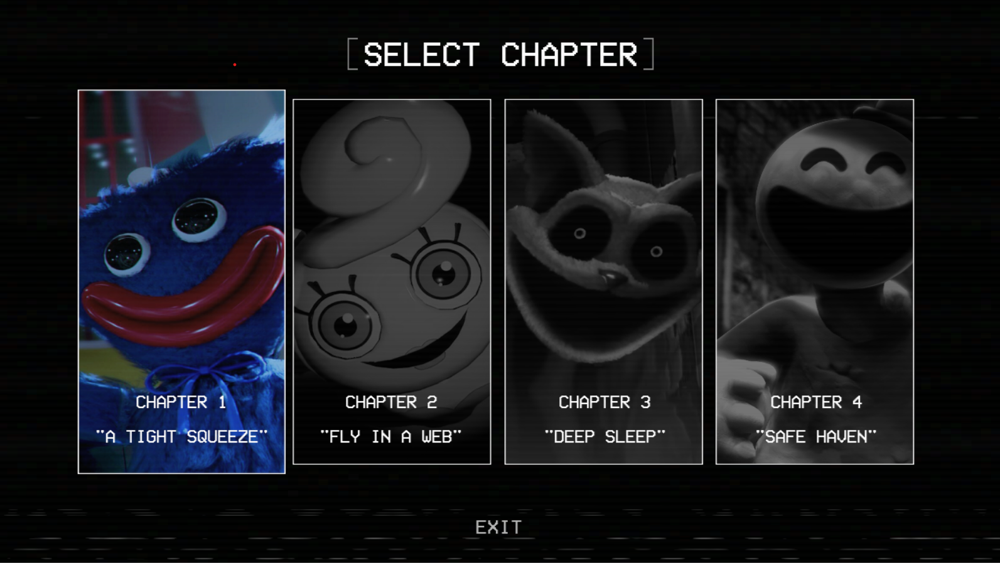
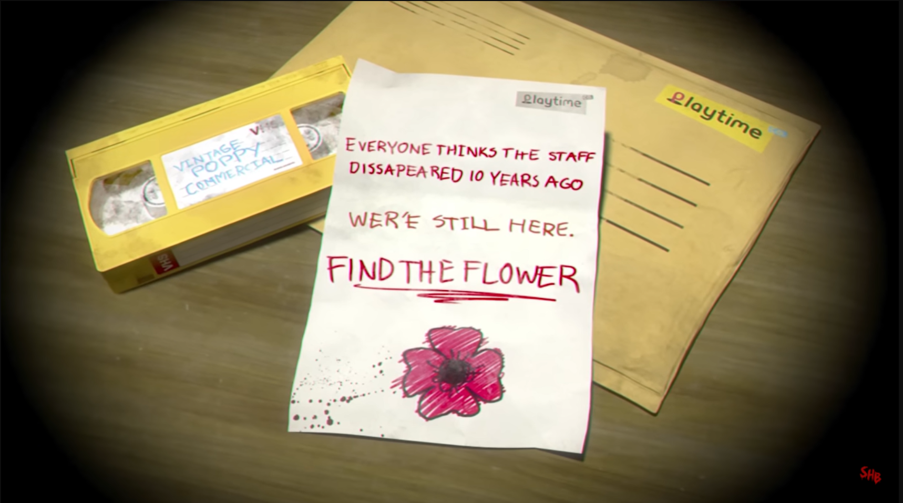

# ***Poppy Playtime Walkthrough***

Having a hard time solving tough puzzles? This walkthrough will teach you everything you need to know about the game—from its story walkthrough, equipment, and boss encounters to all four chapters the game has.

## Chapter 1 - *A TIGHT SQUEEZE*

This chapter has an average playtime of about **55 minutes** if you focus only on the main objective. But if you're a player who wants to experience everything the game has to offer, you'll need at least **1.5 hours** to 100% clear the chapter.

  <a href="../ch1/"><strong><em>100% Complete walk through</em></strong></a>

## Summary

The chapter begins with a former employee of Playtime Co., receiving an unexpected letter along with a VHS tape. The tape appears to be a tampered version of an old Poppy commercial. After reading the letter and watching the tape, curiosity and concern drive the former employee to return to the abandoned factory, hoping to uncover the truth behind the disappearance of the staff.